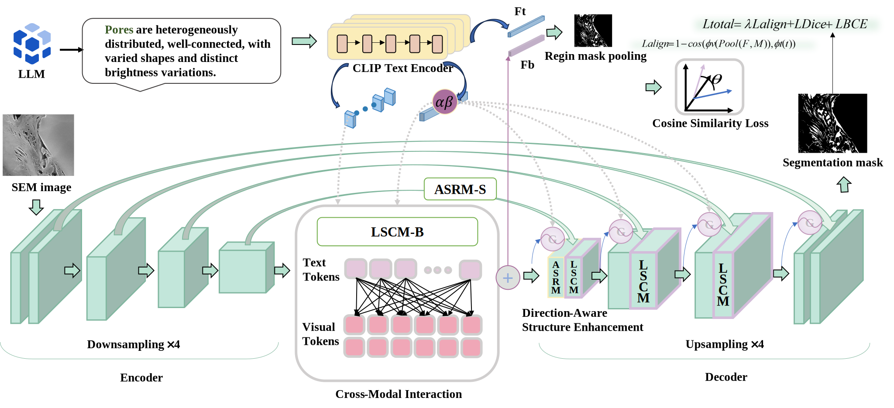
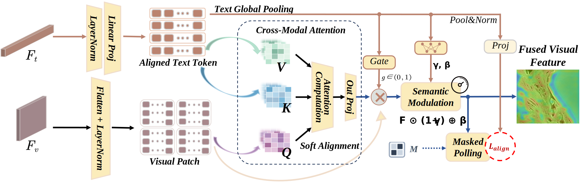
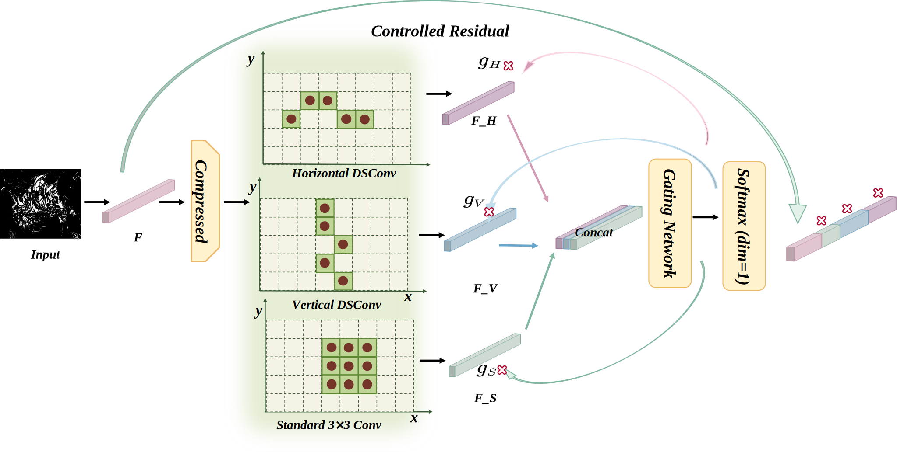

# Robust Pore Structure Segmentation of Core Samples for Reservoir Characterization Using SEM Images and a Semantically Guided Anisotropy-Aware Model

## Model Architecture
The overall architecture of VLSE-Net (vision-language guided structure-enhanced network) consists of two core modules: **LSCM** (semantic calibration) and **ASRM** (anisotropic structural refinement).

<p align="center">
  
</p>

### LSCM (Language-driven Semantic Calibration Module)
<p align="center">
  
</p>

### ASRM (Anisotropic Structure Refinement Module)
<p align="center">
  
</p>

## Overview
Accurate pore segmentation is a fundamental step in digital rock analysis and reservoir microstructural characterisation. In SEM images of rock cores, fluctuating imaging conditions, heterogeneous background textures, and anisotropic/elongated pore morphologies often cause (1) semantic ambiguity between pores and non-pore regions and (2) degraded structural continuity (boundary erosion, fragmentation, and spurious adhesions).

VLSE-Net addresses these challenges via **two complementary modules**:

- **LSCM (Language-driven Semantic Calibration Module)**: injects text priors and cross-modal constraints to stabilise pore semantics under complex backgrounds.
- **ASRM (Anisotropic Structure Refinement Module)**: applies direction-sensitive structural modelling and adaptive fusion to better recover elongated pores, weak boundaries, and locally connected structures.

## Method Summary
### 1) Language-driven Semantic Calibration Module (LSCM)
LSCM leverages the semantic space of a pre-trained vision-language model (CLIP) as an external knowledge anchor for the concept *“pore”*.

Core components described in the paper include:
- **Text prior injection** into visual features (multi-scale semantic modulation along bottleneck/decoder pathways).
- **Fine-grained cross-modal interaction** (token-level cross-attention at the bottleneck).
- **Region-level semantic alignment constraint** via an auxiliary alignment loss to encourage cross-modal consistency.

### 2) Anisotropic Structure Refinement Module (ASRM)
ASRM improves direction-sensitive representation for anisotropic pore structures by introducing multi-branch directional modelling and adaptive gating.

Core ideas described in the paper include:
- A compact representation is processed by **parallel directional branches** (horizontal/vertical/isotropic) to capture anisotropic patterns.
- A lightweight **spatial gating network** produces location-adaptive fusion weights.
- A controlled residual refinement stabilises training while enhancing structural continuity.

## Results (highlights)
From the abstract in `paper/paper-en.tex`:
- On the main dataset, VLSE-Net improves Dice by **+3.12%** over a baseline U-Net.
- Porosity error is reduced by **39.6%** (relative reduction).
- The model also shows stability across heterogeneous datasets.

## Repository Layout
The open-source training and model code lives under `public/`:

- `VLSENet.py`: VLSE-Net model implementation.
- `train_VLSENet.py`: training script for VLSE-Net.
- `train_unet.py`: baseline U-Net training script (for comparisons).
- `clip/`: a lightweight CLIP implementation used by the model.

## Quick Start
### Environment
Typical dependencies:
- Python 3.10+
- PyTorch + torchvision
- numpy, pillow, tqdm

### Dataset format
`train_VLSENet.py` expects a dataset root with the following subfolders (configurable via CLI flags):

- `patch_images/`: RGB images
- `patch_mask/`: binary masks (grayscale)
- `text/`: optional per-image text prompts (`<image_stem>.txt`)

### Train VLSE-Net
Example:

```bash
python train_VLSENet.py \
  --data-root ./dataset
```

Notes:
- Many model features are enabled by default in the public script (e.g., cross-attention text spatial mode, skip attention, multi-scale fusion, AMP when CUDA is available).
- Learning-rate scheduling is supported via `--scheduler plateau` (default) which adapts LR based on validation Dice.

### Outputs
Training outputs are written under `public/reports/` (run-specific folder), including:
- `best_*.pt` / `last_*.pt` checkpoints
- `training_log.csv` / `training_log.json`
- optional validation visualisations
- optional per-epoch training curves
