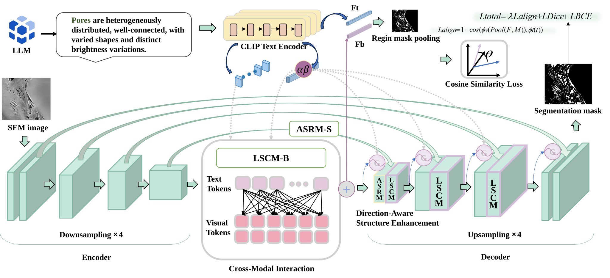
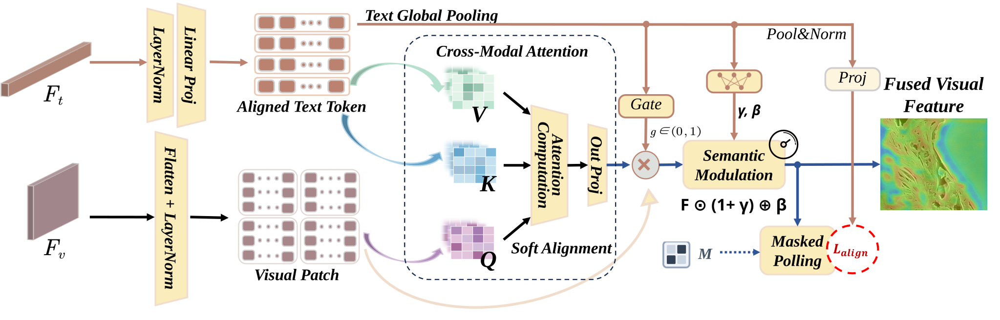
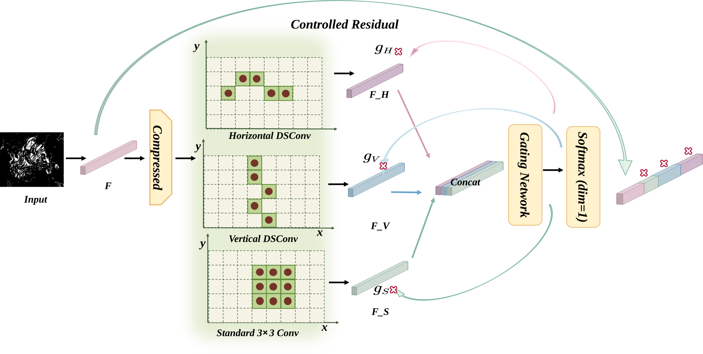

# SEM-Based Pore System Characterisation of Heterogeneous Reservoir Rocks Using Vision-Language Guided Structure-Enhanced Segmentation

This repository provides the official implementation of **VLSE-Net**, a vision-language guided segmentation framework for pore extraction from heterogeneous rock core SEM images.

VLSE-Net is developed for SEM-based digital rock analysis and aims to improve pore-system characterisation by addressing two major challenges:

1. **Pore–matrix semantic ambiguity** caused by heterogeneous mineral textures and similar grayscale appearances.
2. **Structural discontinuity** of elongated pores and weak-boundary pore structures.

The framework integrates two complementary modules:

- **LSCM (Language-driven Semantic Calibration Module)**  
  Introduces vision-language semantic priors and cross-modal constraints to improve pore–matrix discrimination.

- **ASRM (Anisotropic Structure Refinement Module)**  
  Applies direction-sensitive structural modelling and adaptive refinement to preserve elongated and connectivity-related pore structures.

---

# Model Architecture

<p align="center">

</p>


## LSCM: Language-driven Semantic Calibration Module

<p align="center">

</p>

LSCM introduces semantic information from a vision-language model to improve pore recognition under complex geological textures.

Main components:

- Text prior injection into visual features.
- Token-level cross-modal interaction.
- Region-level semantic alignment constraint.


## ASRM: Anisotropic Structure Refinement Module

<p align="center">

</p>

ASRM improves structural representation for anisotropic pore morphologies.

Main components:

- Parallel directional branches for horizontal, vertical and isotropic patterns.
- Adaptive spatial gating for feature fusion.
- Residual refinement for structural continuity preservation.

---

# Installation

## Environment

The implementation was developed and tested with:

- Python >= 3.10
- PyTorch 2.5.1
- torchvision 0.20.1
- CUDA-compatible GPU

The experiments reported in the paper were conducted on:

- GPU: NVIDIA RTX 4090 (24 GB)


## Install Dependencies

Create a virtual environment:

```bash
conda create -n vlsenet python=3.10
conda activate vlsenet
```

Install required packages:

```bash
pip install -r requirements.txt
```

---

# Dataset Availability

The datasets used in this study include both private and public SEM datasets.

## Private datasets

The SCD-1 and SCD-2 datasets used in the paper are not publicly available due to data-use restrictions.

## Public datasets

The following datasets are publicly available from their original sources:

- DRP-317
- cigRockSEM

Dataset preparation scripts are provided for converting SEM images and binary masks into the required training format.

---

# Repository Structure

```
VLSE-Net/
│
├── VLSENet.py              # VLSE-Net implementation
├── train_VLSENet.py        # VLSE-Net training script
├── unet.py                 # U-Net baseline implementation
├── train_unet.py           # U-Net training script
├── DSConv_pro.py           # Direction-aware convolution module
├── feature_renorm.py       # Feature normalization utilities
│
├── clip/                   # CLIP-related components
├── dataset/                # Dataset directory
├── dataset_builder/        # Dataset preparation scripts
├── figures/                # Model visualization files
│
├── requirements.txt
├── LICENSE
└── README.md
```

---

# Dataset Format

`train_VLSENet.py` expects the following directory structure:

```
dataset/
│
├── patch_images/
│   ├── image_001.png
│   └── ...
│
├── patch_mask/
│   ├── image_001.png
│   └── ...
│
└── text/
    ├── image_001.txt
    └── ...
```

Description:

- `patch_images/`: SEM images.
- `patch_mask/`: binary pore masks.
- `text/`: image-specific text prompts for vision-language guidance.

The image and text prompt files should have the same filename.

Example:

```
image_001.png
image_001.txt
```

---

# Training

## Train VLSE-Net

```bash
python train_VLSENet.py \
    --data-root ./dataset
```

## Train U-Net Baseline

```bash
python train_unet.py \
    --data-root ./dataset
```

Training outputs include:

- model checkpoints;
- training logs;
- validation results.

---

# Configuration Parameters

Common parameters include:

| Parameter | Description |
|---|---|
| `--data-root` | Dataset directory |
| `--batch-size` | Training batch size |
| `--lr` | Initial learning rate |
| `--epochs` | Number of training epochs |
| `--scheduler` | Learning-rate scheduler |

Please refer to the training scripts for all available options.

---

# Inference

VLSE-Net takes SEM images and corresponding text prompts as input and produces binary pore segmentation masks.

Input:

- SEM image
- Text prompt

Output:

- Binary pore mask

Workflow:

```
SEM image
    |
    v
VLSE-Net
    |
    v
Binary pore mask
```

---

# Reproducibility

This repository provides:

- VLSE-Net implementation;
- U-Net baseline implementation;
- training scripts;
- dataset preparation tools.

Because of data-use restrictions, the original SCD-1 and SCD-2 datasets cannot be redistributed.

---

# Experimental Results

On the main SEM dataset:

- Dice score improvement: **+3.12 percentage points** over U-Net.
- SEM-derived apparent porosity error reduction: **39.6%**.

VLSE-Net also improves the reliability of pore-system descriptors, including local porosity, connectivity and connected-component density.

---

# License

This project is released under the MIT License.
